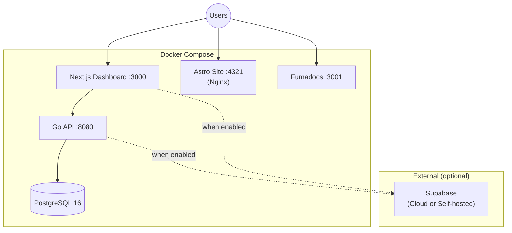

# Full Stack Deployment Guide — paas-boilerplate

> All stacks: **paas-core** (API + Dashboard + DB), **paas-site** (Marketing), **paas-docs** (Documentation), **Supabase** (optional auth)

---

## Architecture



## Prerequisites

| Tool | Version | Check |
|------|---------|-------|
| Docker | 24+ | `docker --version` |
| Docker Compose | v2+ | `docker compose version` |
| Git | any | `git --version` |

---

## 1. Quick Start (Local Development)

```bash
# Clone
git clone <your-repo-url> paas-boilerplate
cd paas-boilerplate

# Configure environment
cp .env.example .env
# Edit .env — at minimum set JWT_SECRET

# Start everything
docker compose up -d --build

# Verify
docker compose ps
```

### Service URLs

| Service | URL | Health Check |
|---------|-----|-------------|
| API | [http://localhost:8080](http://localhost:8080) | `GET /healthz` → `{"status":"ok"}` |
| Dashboard | [http://localhost:3000](http://localhost:3000) | `GET /api/health` |
| Marketing Site | [http://localhost:4321](http://localhost:4321) | `GET /` → 200 |
| Documentation | [http://localhost:3001](http://localhost:3001) | `GET /` → 200 |

---

## 2. Environment Variables

### Full `.env` Reference

```bash
# ─── Database ───
DATABASE_USER=paas
DATABASE_PASSWORD=paas          # ⚠️ Change in production!
DATABASE_NAME=paas
DATABASE_PORT=5432

# ─── Ports ───
API_PORT=8080
WEB_PORT=3000
SITE_PORT=4321
DOCS_PORT=3001

# ─── App ───
APP_NAME=MyPaaS
APP_ENVIRONMENT=development     # development | staging | production

# ─── Auth ───
JWT_SECRET=change-me-in-production-use-a-long-random-string

# ─── CORS ───
# Must match your frontend domains
CORS_ALLOWED_ORIGINS=http://localhost:3000,http://localhost:4321,http://localhost:3001

# ─── Email ───
EMAIL_API_KEY=re_test           # Resend API key
EMAIL_FROM=noreply@localhost

# ─── Billing (Xendit) ───
XENDIT_SECRET_KEY=
XENDIT_WEBHOOK_TOKEN=

# ─── OAuth ───
OAUTH_FRONTEND_URL=http://localhost:3000

# ─── Frontend ───
NEXT_PUBLIC_API_URL=http://localhost:8080
NEXT_PUBLIC_APP_NAME=MyPaaS
NEXT_PUBLIC_AUTH_PROVIDER=local  # local | supabase
```

---

## 3. Supabase Integration (Optional)

> [!NOTE]
> Supabase is **completely optional**. The platform works with local JWT auth by default.

### Option A: Supabase Cloud

1. Create a project at [supabase.com](https://supabase.com)
2. Get your credentials from **Settings → API**
3. Add to `.env`:

```bash
SUPABASE_ENABLED=true
SUPABASE_URL=https://your-project.supabase.co
SUPABASE_ANON_KEY=eyJ...
SUPABASE_SERVICE_KEY=eyJ...
SUPABASE_JWT_SECRET=your-jwt-secret-from-settings
SUPABASE_WEBHOOK_SECRET=your-webhook-secret

NEXT_PUBLIC_AUTH_PROVIDER=supabase
NEXT_PUBLIC_SUPABASE_URL=https://your-project.supabase.co
NEXT_PUBLIC_SUPABASE_ANON_KEY=eyJ...
```

> [!IMPORTANT]
> The `SUPABASE_JWT_SECRET` **must match** the JWT secret from Supabase Settings → API → JWT Secret. This allows the Go API to validate Supabase-issued JWTs.

### Option B: Self-Hosted Supabase (Dokploy / VPS)

If you run Supabase Community Edition on your VPS:

```bash
SUPABASE_ENABLED=true
SUPABASE_URL=https://supabase.yourdomain.com
SUPABASE_ANON_KEY=<your-generated-anon-key>
SUPABASE_SERVICE_KEY=<your-generated-service-key>
SUPABASE_JWT_SECRET=<your-jwt-secret>
SUPABASE_WEBHOOK_SECRET=<generate-a-random-string>

NEXT_PUBLIC_AUTH_PROVIDER=supabase
NEXT_PUBLIC_SUPABASE_URL=https://supabase.yourdomain.com
NEXT_PUBLIC_SUPABASE_ANON_KEY=<your-generated-anon-key>
```

### Webhook Configuration

When Supabase is enabled, configure a webhook in Supabase to sync auth events:

| Setting | Value |
|---------|-------|
| **URL** | `https://api.yourdomain.com/api/v1/webhooks/supabase/auth` |
| **Events** | `INSERT`, `UPDATE`, `DELETE` on `auth.users` |
| **Headers** | `X-Webhook-Signature: <HMAC-SHA256 of body with SUPABASE_WEBHOOK_SECRET>` |

---

## 4. Production Deployment

### 4a. Dokploy / VPS Deployment

```bash
# On your VPS
git clone <your-repo-url> /opt/paas-boilerplate
cd /opt/paas-boilerplate
cp .env.example .env
```

Edit `.env` for production:

```bash
APP_ENVIRONMENT=production
DATABASE_PASSWORD=<strong-random-password>
JWT_SECRET=<64-char-random-string>

# Domain-aware CORS
CORS_ALLOWED_ORIGINS=https://app.yourdomain.com,https://docs.yourdomain.com

# Frontend points to API via domain
NEXT_PUBLIC_API_URL=https://api.yourdomain.com
OAUTH_FRONTEND_URL=https://app.yourdomain.com
```

Build & run:

```bash
docker compose up -d --build
```

### 4b. Reverse Proxy (Traefik / Nginx / Caddy)

The compose exposes these ports — route your reverse proxy accordingly:

| Domain | Container Port | Service |
|--------|---------------|---------|
| `yourdomain.com` | `4321` (→ 80 internal) | `site` |
| `app.yourdomain.com` | `3000` | `web` |
| `api.yourdomain.com` | `8080` | `api` |
| `docs.yourdomain.com` | `3001` (→ 3000 internal) | `docs` |

#### Traefik Example (docker labels)

If using Traefik as reverse proxy, add labels to each service in `docker-compose.yml`:

```yaml
# Example for api service:
labels:
  - "traefik.enable=true"
  - "traefik.http.routers.api.rule=Host(`api.yourdomain.com`)"
  - "traefik.http.routers.api.tls.certresolver=le"
  - "traefik.http.services.api.loadbalancer.server.port=8080"
```

#### Nginx Example

```nginx
# /etc/nginx/conf.d/paas.conf
server {
    server_name yourdomain.com;
    location / { proxy_pass http://127.0.0.1:4321; }
}
server {
    server_name app.yourdomain.com;
    location / { proxy_pass http://127.0.0.1:3000; }
}
server {
    server_name api.yourdomain.com;
    location / { proxy_pass http://127.0.0.1:8080; }
}
server {
    server_name docs.yourdomain.com;
    location / { proxy_pass http://127.0.0.1:3001; }
}
```

### 4c. TLS / SSL

- **Recommended**: Wildcard cert `*.yourdomain.com` + `yourdomain.com`
- **Let's Encrypt**: Use certbot or reverse proxy ACME
- **Dokploy**: Handled automatically via built-in Traefik

---

## 5. File Structure (Post-Setup)

```
paas-boilerplate/
├── docker-compose.yml          ← Unified compose (all services)
├── .env.example                ← Template for environment variables
├── .env                        ← Your actual config (gitignored)
│
├── paas-core/
│   ├── apps/api/               ← Go REST API
│   ├── apps/web/               ← Next.js Dashboard
│   └── deploy/docker/
│       ├── Dockerfile.api      ← API multi-stage build
│       └── Dockerfile.web      ← Dashboard multi-stage build
│
├── paas-site/
│   ├── Dockerfile              ← Astro → Nginx (static)
│   └── src/                    ← Astro source
│
└── paas-docs/
    ├── Dockerfile              ← Next.js standalone
    ├── next.config.ts          ← output: 'standalone'
    └── src/                    ← Fumadocs source
```

---

## 6. Operations

### Scaling

```bash
# Scale API horizontally
docker compose up -d --scale api=3

# Note: when scaling API, use a shared session store
# or ensure JWT-based stateless auth (default)
```

### Monitoring

```bash
# View all logs
docker compose logs -f

# Specific service
docker compose logs -f api

# Resource usage
docker stats
```

### Database Backup

```bash
# Backup
docker compose exec postgres pg_dump -U paas paas > backup.sql

# Restore
docker compose exec -T postgres psql -U paas paas < backup.sql
```

### Updates

```bash
git pull
docker compose up -d --build
```

---

## 7. Troubleshooting

| Issue | Fix |
|-------|-----|
| API can't connect to DB | Check `DATABASE_HOST=postgres` and DB health |
| CORS errors | Verify `CORS_ALLOWED_ORIGINS` matches your frontend domains |
| Dashboard 401 | Check `JWT_SECRET` matches between API and Supabase |
| Site returns 404 | Astro build might have failed — check `docker compose logs site` |
| Docs not loading | Verify `output: 'standalone'` in `next.config.ts` |
