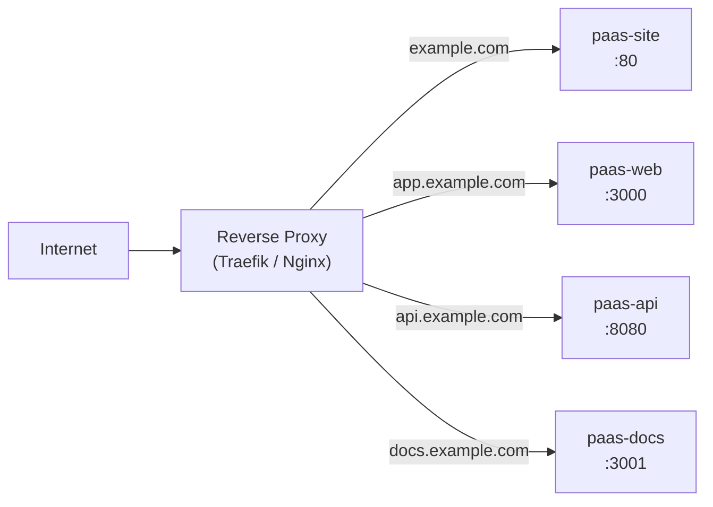

# Domain Routing Plan

## Overview

This document describes the domain routing strategy for the MyPaaS platform.
All services are designed for reverse-proxy deployment (Traefik, Nginx, Caddy, or PaaS built-in).

## Routing Table

| Domain | Service | Repo | Container |
|--------|---------|------|-----------|
| `example.com` | Marketing website | `paas-site` | `paas-site` (Nginx) |
| `app.example.com` | Dashboard (Next.js) | `paas-core` | `paas-web` |
| `api.example.com` | REST API (Go) | `paas-core` | `paas-api` |
| `docs.example.com` | Documentation (Fumadocs) | `paas-docs` | `paas-docs` |



## CORS Policy

| Origin | Allowed by API? | Notes |
|--------|----------------|-------|
| `https://app.example.com` | ✅ Yes | Dashboard calls API |
| `https://example.com` | ❌ No | Marketing site is static, no API calls |
| `https://docs.example.com` | ✅ Yes (read-only) | API playground in docs may need access |

### API CORS Configuration

```
CORS_ALLOWED_ORIGINS=https://app.example.com,https://docs.example.com
CORS_ALLOWED_METHODS=GET,POST,PUT,PATCH,DELETE,OPTIONS
CORS_ALLOWED_HEADERS=Content-Type,Authorization,X-Request-ID
CORS_ALLOW_CREDENTIALS=true
CORS_MAX_AGE=86400
```

## Cookie Domain Policy

For JWT authentication via HttpOnly cookies:

| Setting | Value | Rationale |
|---------|-------|-----------|
| `Domain` | `.example.com` | Share cookie between `app` and `api` subdomains |
| `Path` | `/` | Available on all paths |
| `Secure` | `true` | HTTPS only |
| `HttpOnly` | `true` | Not accessible via JavaScript |
| `SameSite` | `Lax` | Protect against CSRF while allowing navigation |

> **Note**: If `app` and `api` are on different root domains (not recommended), you'll need to switch to Bearer token auth instead of cookies.

## TLS / SSL

- All subdomains should have valid TLS certificates.
- Recommended: Use Let's Encrypt with wildcard cert `*.example.com` + `example.com`.
- Or: Individual certs per subdomain via your PaaS/reverse proxy ACME integration.

## Health Check Endpoints

| Service | Endpoint | Expected Response |
|---------|----------|-------------------|
| API | `GET /healthz` | `200 {"status":"ok"}` |
| API | `GET /readyz` | `200 {"status":"ready","db":"ok"}` |
| Web | `GET /api/health` | `200 {"status":"ok"}` |
| Site | `GET /` | `200` (static HTML) |
| Docs | `GET /` | `200` (Next.js page) |
