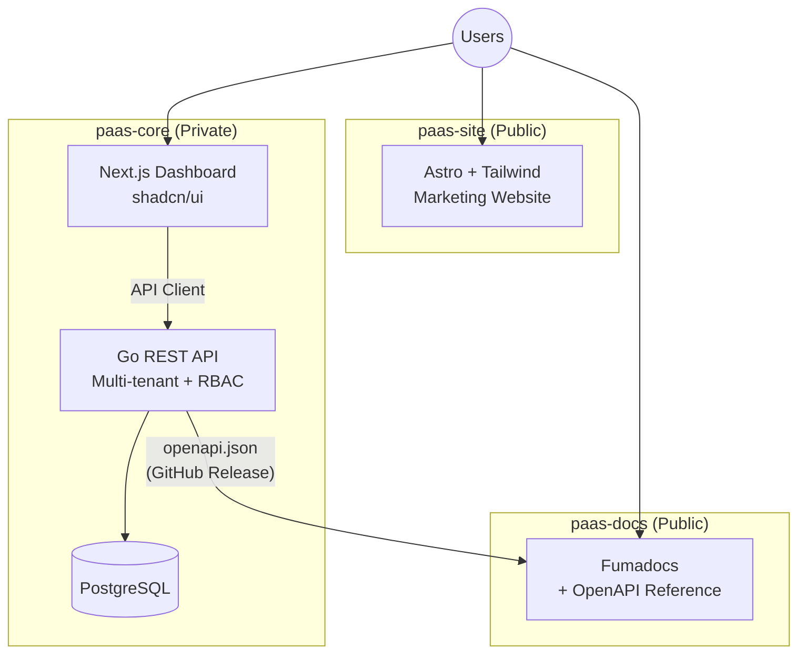

# MyPaaS — Full Stack PaaS Platform

A multi-tenant Platform-as-a-Service workspace template, Docker-ready, designed for deployment on PaaS platforms (Dokploy, Coolify, or similar).

## Architecture



## Repository Structure

```
paas-boilerplate/
├── paas-core/          # Private: Go API + Next.js Dashboard monorepo
│   ├── apps/api/       # Go REST API (multi-tenant, RBAC, OpenAPI)
│   ├── apps/web/       # Next.js dashboard (shadcn/ui)
│   ├── packages/       # Shared packages (API client)
│   └── deploy/         # Docker configs
├── paas-site/          # Public: AstroWind marketing website
├── paas-docs/          # Public: Fumadocs + OpenAPI auto-gen
├── STACK.config.json   # Workspace configuration
├── DOMAIN_ROUTING.md   # Domain & routing plan
├── RELEASE_FLOW.md     # Cross-repo release workflow
└── README.md           # This file
```

## Quick Start

### Prerequisites
- [Docker](https://docs.docker.com/get-docker/) & Docker Compose
- [Go](https://golang.org/dl/) 1.22+
- [Node.js](https://nodejs.org/) 20+ & [pnpm](https://pnpm.io/)

### Run Everything (Docker Compose)

```bash
# 1. Start the core platform (API + Dashboard + DB)
cd paas-core
cp .env.example .env
docker compose up -d

# 2. Start the marketing site
cd ../paas-site
npm install && npm run dev

# 3. Start the docs site
cd ../paas-docs
npm install && npm run dev
```

### Individual Repos

| Repo | Dev Command | Docker Build | URL |
|------|------------|-------------|-----|
| `paas-core` (API) | `cd paas-core && make dev` | `docker compose up` | `http://localhost:8080` |
| `paas-core` (Web) | `cd paas-core/apps/web && pnpm dev` | (part of compose) | `http://localhost:3000` |
| `paas-site` | `cd paas-site && npm run dev` | `docker build -t paas-site .` | `http://localhost:4321` |
| `paas-docs` | `cd paas-docs && npm run dev` | `docker build -t paas-docs .` | `http://localhost:3001` |

## Domain Plan

| Domain | Service |
|--------|---------|
| `example.com` | Marketing site |
| `app.example.com` | Dashboard |
| `api.example.com` | REST API |
| `docs.example.com` | Documentation |

See [DOMAIN_ROUTING.md](./DOMAIN_ROUTING.md) for full routing, CORS, and cookie policies.

## Tech Stack

| Layer | Technology |
|-------|------------|
| API | Go, Chi router, sqlc/pgx, JWT |
| Dashboard | Next.js 15, React 19, shadcn/ui, Tailwind CSS |
| Marketing | Astro 5, Tailwind CSS |
| Docs | Fumadocs, Next.js, fumadocs-openapi |
| Database | PostgreSQL 16 |
| API Client | Orval (OpenAPI → TypeScript) |
| Containers | Docker, Docker Compose |
| CI/CD | GitHub Actions |

## Configuration

All workspace-level configuration is in [`STACK.config.json`](./STACK.config.json).
See each repo's `.env.example` for service-specific configuration.

## Release Flow

See [RELEASE_FLOW.md](./RELEASE_FLOW.md) for the cross-repo release and OpenAPI sync workflow.

## License

Private — All rights reserved.
