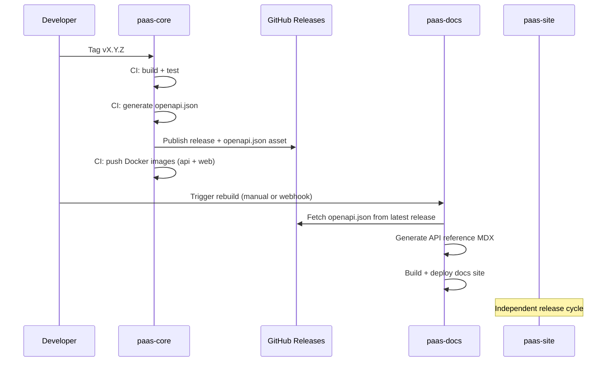

# Release Flow — Cross-Repo Coordination

## Overview

This document describes how releases are coordinated across the three repositories.

## `paas-core` Release

### Trigger
- Git tag `vX.Y.Z` on `main` branch.

### CI Pipeline Steps
1. Run tests (`go test`, `npm test`)
2. Build Go API binary
3. Generate `openapi.json` from API
4. Build Docker images:
   - `ghcr.io/myorg/paas-api:vX.Y.Z`
   - `ghcr.io/myorg/paas-web:vX.Y.Z`
5. Create GitHub Release with:
   - Release notes (auto-generated or manual)
   - `openapi.json` as release asset
6. Push Docker images to registry

### Versioning
- Semantic versioning: `MAJOR.MINOR.PATCH`
- Breaking API changes → bump MAJOR
- New features → bump MINOR
- Bug fixes → bump PATCH

## `paas-docs` Release

### Trigger
- Manual dispatch (recommended)
- Or: GitHub webhook on `paas-core` release

### CI Pipeline Steps
1. Fetch `openapi.json` from `paas-core` release:
   - Default: latest release
   - Or: specific version via `OPENAPI_VERSION` env var
2. Run `fumadocs-openapi` generator → produce MDX files
3. Build Next.js docs site
4. Deploy (Docker push or static deploy)

### OpenAPI Fetch Strategy
Configured via `OPENAPI_SYNC` in `STACK.config.json`:

| Strategy | Source | Use Case |
|----------|--------|----------|
| `release-asset` (default) | GitHub Release asset | Standard GitHub workflow |
| `s3` | S3/MinIO public bucket | Self-hosted / air-gapped |
| `fetch-url` | Any public URL | Flexible / custom CI |

## `paas-site` Release

### Trigger
- Independent schedule (content changes, marketing updates)
- No dependency on `paas-core` releases

### CI Pipeline Steps
1. Build Astro static site
2. Build Docker image with Nginx
3. Deploy

## Docker Image Tags

| Image | Tag Pattern | Example |
|-------|-------------|---------|
| `paas-api` | `vX.Y.Z`, `latest` | `ghcr.io/myorg/paas-api:v1.2.3` |
| `paas-web` | `vX.Y.Z`, `latest` | `ghcr.io/myorg/paas-web:v1.2.3` |
| `paas-docs` | `vX.Y.Z`, `latest` | `ghcr.io/myorg/paas-docs:v1.0.0` |
| `paas-site` | `vX.Y.Z`, `latest` | `ghcr.io/myorg/paas-site:v1.0.0` |

## Rollback

1. Revert to previous Docker image tag
2. For API: ensure DB migrations are backward-compatible (no destructive migrations)
3. For docs: re-fetch previous version's `openapi.json` and rebuild
